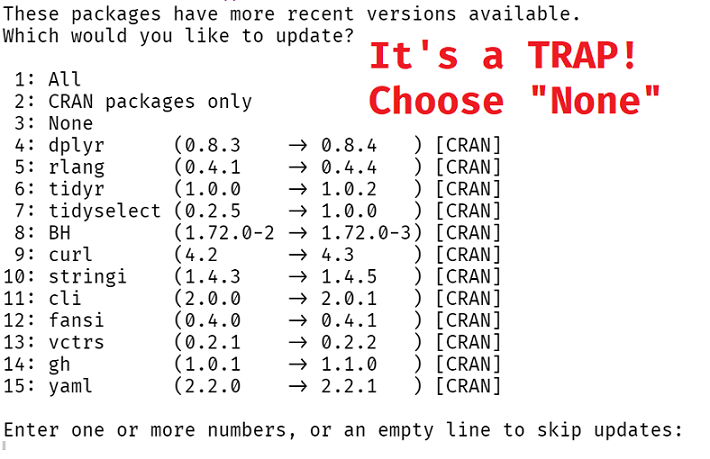
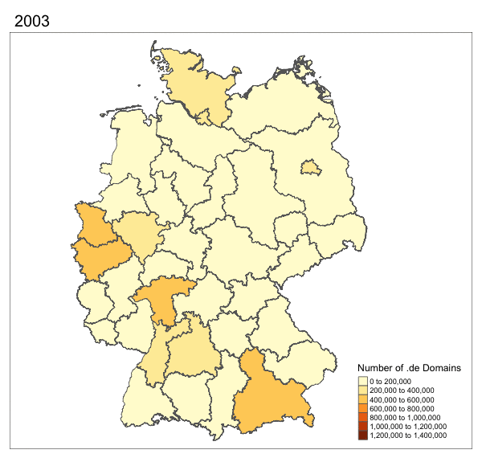
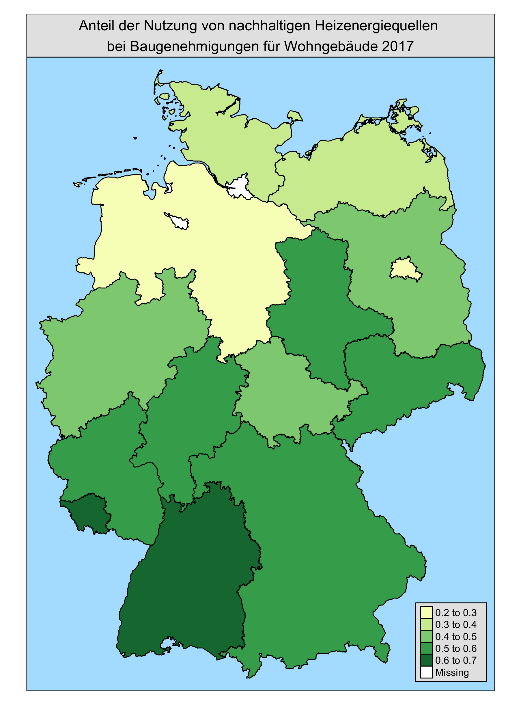

<style>
.onehundredtwenty {
  font-size: 120%;
   }

<style>
.ninety {
  font-size: 90%;
   }

.eightyfive {
  font-size: 85%;
   }
   
.eighty {
  font-size: 80%;
   }
   
.seventyfive {
  font-size: 75%;
   }
   
.seventy {
  font-size: 70%;
   }
   
.sixty {
  font-size: 60%;
   }
   
.fifty {
  font-size: 50%;
   }
</style>


```{r, include = F}
pacman::p_load(tidyverse, datenguideR, knitr, testthat, devtools, usethis)

#Default Options - kann bei Gebrauch geändert werden
knitr::opts_chunk$set(warning = F, message = F) # Whether to display errors


```


.pull-left[


### How to `datenguideR`

The `rOpenSci Package guide` states that:

]


.pull-right[


```{r, echo = F, out.width=100, out.height=120, fig.align='right'}
knitr::include_graphics("images/logo3.png")


```

]

> Functions and arguments naming should be chosen to work together to form a common, logical programming API that is easy to read, and auto-complete.


So in the best case scenario you come up with a naming scheme in the following style:

+ `object_verb`

This scheme 

+ helps avoid namespace conflicts with packages that may have similar verbs
+ makes code readable and easy to auto-complete

In `datenguideR` all functions start with `dg_*`, for example `dg_call`, `dg_descriptions` etc.


---

.pull-left[


### How to `datenguideR`

First install `datenguideR` from GitHub (not yet on CRAN)

]


.pull-right[


```{r, echo = F, out.width=100, out.height=120, fig.align='right'}
knitr::include_graphics("images/logo3.png")
```

]


```{r, eval = F}
devtools::install_github("CorrelAid/datenguideR")
```

--


---


### Metadata with `dg_descriptions`

Get all available meta data on statistics, substatistics, and parameters:

```{r, paged.print = F}
datenguideR::dg_descriptions


```


---


### Metadata with `dg_descriptions`

Variables are hierarchically organized on **three levels**: `stat`, `substat` and `param`.  A `stat` may or may not have any `substats` and a `substat` may or not have any `params`. It completely depends on the variable.

```{r, eval  = F}

stat level                  
 ¦--stat_name
 ¦--stat_description
 ¦--stat_description_en
 ¦--stat_description_full
 ¦--stat_description_full_en
 ¦
 °--substat level
     ¦--substat_name
     ¦--substat_description
     ¦--substat_description_en 
     ¦  
     °--param level       
         ¦--param_name  
         ¦--param_description
         ¦--param_description_en
```


---


class: center, middle, inverse

## Confused?


### Let's consider an example 

---


### Metadata with `dg_descriptions`

Let's consider the example of statistics on new German citizens (`BEV008`)

```{r, eval  = F}

stat level                  
 ¦--stat_name
 ¦--stat_description
 ¦--stat_description_en
 ¦--stat_description_full
 ¦--stat_description_full_en
 ¦
 °--substat level
     ¦--substat_name
     ¦--substat_description
     ¦--substat_description_en 
     ¦  
     °--param level       
         ¦--param_name  
         ¦--param_description
         ¦--param_description_en
```


---

### Metadata with `dg_descriptions`

Let's consider the example of statistics on new German citizens (`BEV008`)

```{r, eval  = F}

stat level                  
 ¦--stat_name: BEV008
 ¦--stat_description: Einbürgerungen von Ausländern	
 ¦--stat_description_en: Naturalizations of Foreigners	
 ¦--stat_description_full: ... 
 ¦--stat_description_full_en: ...
 ¦
 °--substat level
     ¦--substat_name: STAKNW
     ¦--substat_description: Kontinente (einschl. staatenlos etc.)	
     ¦--substat_description_en: Continents (Including Stateless Etc.)		
     ¦  
     °--param level       
         ¦--param_name: ST997
         ¦--param_description: Staatenlos, unbekannt, ungeklärt, ohne Angabe		
         ¦--param_description_en: Stateless, Unknown, Unsettled, without Information
```


---

### Metadata with `dg_descriptions`

First, there is the `stat_*` level.

```{r, eval  = F}

stat level           #<<       
 ¦--stat_name: BEV008  #<<
 ¦--stat_description: Einbürgerungen von Ausländern	#<<
 ¦--stat_description_en: Naturalizations of Foreigners	#<<
 ¦--stat_description_full: ... #<<
 ¦--stat_description_full_en: ...   #<<
 ¦
 °--substat level
     ¦--substat_name: STAKNW
     ¦--substat_description: Kontinente (einschl. staatenlos etc.)	
     ¦--substat_description_en: Continents (Including Stateless Etc.)		
     ¦  
     °--param level       
         ¦--param_name: ST997
         ¦--param_description: Staatenlos, unbekannt, ungeklärt, ohne Angabe		
         ¦--param_description_en: Stateless, Unknown, Unsettled, without Information
```


---

### Metadata with `dg_descriptions`

The variable `stat_description_full_en` includes a long English description of a given statistic (written up in Markdown):

--

.seventyfive[


```{r, eval  = T, results='asis', echo=F}

dg_descriptions %>% 
  filter(stat_name == "BEV008") %>% 
  slice(1) %>% 
  pull(stat_description_full_en) %>%
  cat()

```


]

---

### Metadata with `dg_descriptions`

Next, there is the `substat_*` level. In the example, the substatistic splits new statistics by continent of origin (`STAKNW`).

```{r, eval  = F}

stat level                  
 ¦--stat_name: BEV008
 ¦--stat_description: Einbürgerungen von Ausländern	
 ¦--stat_description_en: Naturalizations of Foreigners	
 ¦--stat_description_full: ... 
 ¦--stat_description_full_en: ...
 ¦
 °--substat level     #<<
     ¦--substat_name: STAKNW     #<<
     ¦--substat_description: Kontinente (einschl. staatenlos etc.)     #<<	
     ¦--substat_description_en: Continents (Including Stateless Etc.)	     #<<	
     ¦  
     °--param level       
         ¦--param_name: ST997
         ¦--param_description: Staatenlos, unbekannt, ungeklärt, ohne Angabe		
         ¦--param_description_en: Stateless, Unknown, Unsettled, without Information
```

Other possible examples of a substat for `BEV008` is the statistic split up by age groups (`ALTX04`) or Length of Stay (`AUFDA1`).

---

### Metadata with `dg_descriptions`

Next, there is the `param_*` level. In the example, we use `ST997` which queries new citizens who were "stateless" or have unknown origins.


```{r, eval  = F}

stat level                  
 ¦--stat_name: BEV008
 ¦--stat_description: Einbürgerungen von Ausländern	
 ¦--stat_description_en: Naturalizations of Foreigners	
 ¦--stat_description_full: ... 
 ¦--stat_description_full_en: ...
 ¦
 °--substat level     
     ¦--substat_name: STAKNW    
     ¦--substat_description: Kontinente (einschl. staatenlos etc.)    	
     ¦--substat_description_en: Continents (Including Stateless Etc.)	    	
     ¦  
     °--param level       #<<
         ¦--param_name: ST997    #<<
         ¦--param_description: Staatenlos, unbekannt, ungeklärt, ohne Angabe	 #<<	
         ¦--param_description_en: Stateless, Unknown, Unsettled, without Information #<<
```


---


class: center, middle, inverse

## You might be thinking:


### Don't worry, that's why we build `dg_search()`


---

### How to use `dg_search`

`dg_search` matches your string with any variable in `dg_descriptions`, returning only rows with those matches.

Looking for variables where the string *"vote"* appears somewhere in the documentation:

```{r, eval = F, paged.print = F}
dg_search("vote") 
```

```{r, echo = F, paged.print = F}
dg_search("vote") %>% 
  ## only select english translations
  dplyr::select(stat_name, dplyr::contains("_en"))
```


---

### How to `datenguideR`


Get IDs of all available NUTS-1 regions:

```{r, paged.print = TRUE}
datenguideR::dg_regions %>%
  dplyr::filter(level == "nuts1") 
```


---


class: center, middle, inverse

# `dg_call`


## The main work horse of `datenguideR`


---

### How to use `dg_call`

Main arguments of `dg_call`:

<br>

```{r, paged.print = F, results='asis', echo = F}
stats_vars <- c("region_id",
                "stat_name",
                "substat_name",
                "parameter",
                "year",
                "nuts_nr",
                "lau_nr",
                "full_descriptions")

desc <- c("The ID of a specific region", 
  "Main statistic",
  "Sub-statistic", 
  "Parameter<br>Defaults to all",
  "Year(s)", 
  "NUTS level", 
  "LAU level",
  "Full descriptions<br>Defaults to `FALSE`")


tibble::tibble(arguments = stats_vars, description = desc) %>% htmlTable::htmlTable(rnames = F)
```


---

### How to use `dg_call`

```{r, paged.print = T, results='asis'}
dg_call(nuts_nr = 1,             # NUTS-1    
        year = 2017,             # Specify Year  
        stat_name = "BEV008",    # Stats on New Citizens  
        substat_name = "STAKNW", # By Continent  
        parameter = "GESAMT")    # All categories summed   
```

---

### How to use `dg_call`

```{r, eval  = F}

dg_call(nuts_nr = 1,                  # NUTS-1 #<<
        year = 2017,                  # Specify Year  #<<
        stat_name = "BEV008",         # Stats on New Citizens        #<<
        substat_name = "STAKNW") %>%  # By Continent  #<<
  filter(STAKNW != "GESAMT") %>% 
  group_by(param_description_en) %>% 
  summarise(value = sum(value)) %>% 
  mutate(param_description_en = ifelse(
    str_detect(param_description_en, "Stateless"), "Stateless", param_description_en
    )
  ) %>% 
  mutate(param_description_en = fct_reorder(param_description_en, value)) %>% 
  ggplot(aes(param_description_en, value)) +
  geom_col(fill = "darkblue", alpha = .75) +
  geom_label(aes(label = value)) +
  theme_minimal() +
  labs(x = "", y = "Number of New Citizens\n", 
       title = "New German Citizens by Origin Continent (2017)",
       caption = "Source: Einbürgerungsstatistik") +
  scale_y_continuous(labels = scales::comma, limits = c(0, 70000)) 
```

---

### How to use `dg_call`

```{r, eval  = T, echo = F, width = 10, height = 15,out.width=600, out.height=500, fig.align="center"}

dg_call(nuts_nr = "1", #<<
        year = 2017,   #<<
        stat_name = "BEV008",  #<<
        substat_name = "STAKNW") %>% #<<
  filter(STAKNW != "GESAMT") %>% 
  group_by(param_description_en) %>% 
  summarise(value = sum(value)) %>% 
  mutate(param_description_en = ifelse(
    str_detect(param_description_en, "Stateless"), "Stateless", param_description_en
    )
  ) %>% 
  mutate(param_description_en = fct_reorder(param_description_en, value)) %>% 
  ggplot(aes(param_description_en, value)) +
  geom_col(fill = "darkblue", alpha = .75) +
  geom_label(aes(label = value)) +
  theme_minimal() +
  labs(x = "", y = "Number of New Citizens\n", 
       title = "New German Citizens by Origin Continent (2017)",
       caption = "Source: Einbürgerungsstatistik") +
  scale_y_continuous(labels = scales::comma, limits = c(0, 70000)) 
```

---


### How to use `dg_map`

```{r, eval = F}
dg_map(nuts_nr = 1,               #<<
        year = 2017,              #<< 
        stat_name = "AI0506")  +  #<<
  ggthemes::theme_map() +
  ggplot2::scale_fill_viridis_c("Voter Turnout") +
  ggplot2::ggtitle("Voter Turnout in German Parliamentary Election (2017)") +
  ggplot2::theme(legend.position = "right")

```

---

### How to use `dg_map`

```{r, eval = T, echo = F, fig.align='center'}
dg_map(nuts_nr = 1,  #<<
        year = 2017, #<< # 
        stat_name = "AI0506")  +  #<<
  ggthemes::theme_map() +
  ggplot2::scale_fill_viridis_c("Voter Turnout") +
  ggplot2::ggtitle("Voter Turnout in German Parliamentary Election (2017)") +
  ggplot2::theme(legend.position = "right")

```


---

class: center, middle


## More Maps!

---

class: center



---


class: center

```{r, echo = F, out.width=450, out.height=600, fig.align='center'}



```


---

## Hackathon Instructions

You can fork/download this [GitHub repository](https://github.com/favstats/dg_workshop_berlinR), which includes the slides and some example code.

You can also use *Rstudio Cloud*. We set up a "classroom" with all necessary packages pre-installed. Here is the [invite link](https://rstudio.cloud/spaces/49837/join?access_code=VCjFndcJdRrG7M1DP2VAq45LWZtan4xzHjhpUu
xQ).

In the end, you can present your dashboards, shiny apps, plots or analyses.

The best submissions will be shared on Twitter and may receive some goodies (stickerzzzzz! <3)

Feel free to play around with the data!

---

## Some Examples and Challenges

.sixty[


```{r, echo = F}


hackmd_dat <- tibble::tribble(
  ~Name.der.Statistik,                                                              ~Beschreibung,                  ~"Challenge",
             "AENW01",                            "Entsorgte/behandelte Abfallmenge a.d. eig. BL", "Umweltschutz/Nachhaltigkeit",
             "AI1901",                                            "Haushaltsabfälle je Einwohner", "Umweltschutz/Nachhaltigkeit",
             "AI_Z04", "Anteil Personen mit MHG [Migrationshintergrund] an der Gesamtbevölkerung",                   "Migration",
             "AI0801",                                                        "Arbeitslosenquote",            "Arbeitslosigkeit",
             "AI2102",                                                "SGB II-Quote bis 64 Jahre",            "Arbeitslosigkeit",
             "ERW009",                             "Arbeitslosenquote bez. auf alle Erwerbspers.",            "Arbeitslosigkeit",
             "AI0506",                                          "Wahlbeteiligung, Bundestagswahl",                     "Politik",
             "AI0606",                                              "Wahlbeteiligung, Europawahl",                     "Politik",
             "WAHL09",                                                     "Gültige Zweitstimmen",                     "Politik",
             "WAHLSR",                                                          "Wahlbeteiligung",                     "Politik",
             "AI1302",                               "Straßenverkehrsunfälle je 10.000 Einwohner",                     "Verkehr",
             "AI1304",                       "Getötete bei Straßenverkehrsunfällen je 100.000 EW",                     "Verkehr",
             "AI1601",                                       "Verfügbares Einkommen je Einwohner",        "Soziale Ungleichheit",
             "AI1703",                                                         "BIP je Einwohner",        "Soziale Ungleichheit",
             "FLC001",                                               "Wohnfläche in Wohngebäuden",                      "Wohnen",
    "BAU009 & WOHNGB",                                                              "Wohngebäude",                      "Wohnen"
  ) 
  
# hackmd_dat %>% 
#   dplyr::pull(Challenge) %>% 
#   dput()

stat_names <- c("AENW01", "AI1901", "AI_Z04", "AI0801", "AI2102", "ERW009", 
"AI0506", "AI0606", "WAHL09", "WAHLSR", "AI1302", "AI1304", "AI1601", 
"AI1703", "FLC001", "BAU009", "WOHNGB")

challenges <- c("Environmental Protection / Sustainability", "Environmental Protection / Sustainability",
"Migration", "Unemployment", "Unemployment", "Unemployment",
"Politics", "Politics", "Politics", "Politics", "Traffic", "Traffic",
"Social Inequality", "Social Inequality", "Housing", "Housing", "Housing"
)

datenguideR::dg_descriptions %>% 
  dplyr::filter(stat_name %in% stat_names) %>% 
  dplyr::distinct(stat_name, .keep_all = T) %>% 
  dplyr::select(stat_name, description_en = stat_description_en) %>% 
  dplyr::mutate(stat_name = forcats::fct_relevel(stat_name, stat_names)) %>% 
  dplyr::arrange(stat_name) %>% 
  dplyr::mutate(challenge = challenges) %>% 
  htmlTable::htmlTable(rnames = F)

```

]


---

class: center, middle, inverse

### Submissions from Previous Workshop


Click [here](https://github.com/TripLLL/weRnuts3) for GitHub repository

---

class: center, middle, inverse

### It's time to type some R code


#### Let's get to the
### `H A C K I N G`


---


class: center, middle, inverse

### Thank you for listening


